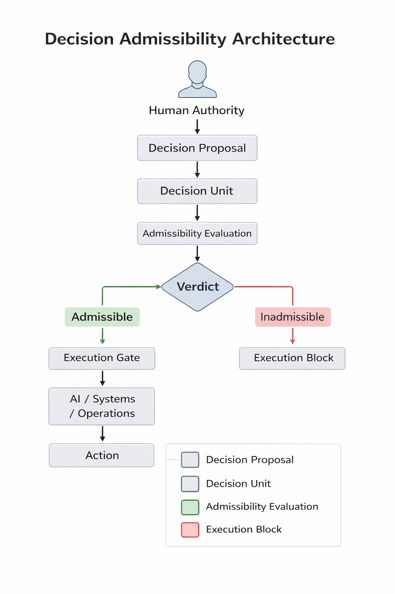

# Decision Admissibility Infrastructure

Decision Admissibility Infrastructure describes a governance architecture designed to determine whether a decision may enter the execution path before any automated reasoning or operational action occurs.

Most AI governance frameworks focus on monitoring, auditing, or evaluating system behavior after execution.

However, the critical governance boundary exists earlier: at the moment when a proposed decision transitions from proposal to execution.

Decision Admissibility introduces a structural control layer that evaluates whether a decision is admissible to execute under defined organizational constraints.

---

## Core Principle

A decision should not execute merely because it was proposed, documented, or approved.

Execution should occur only after the decision's admissibility has been structurally established.

---

## Architectural Model

The minimal architectural model is:
### Decision Admissibility Control Flow

```mermaid
flowchart TD

A[Human Authority] --> B[Decision Proposal]

B --> C[Decision Intake Layer]

C --> D[Decision Unit Normalization]

D --> E[Decision Unit]

E --> F[Authority Verification]

F --> G[Admissibility Engine]

O[Constitutional Rules Engine] --> G

G --> H{Admissibility Verdict}

H -->|Admissible| I[Execution Gate]

I --> J[System Interface]

J --> K[AI Systems / Enterprise Systems / Operations]

K --> L[Action Executed]

H -->|Inadmissible| M[Execution Block]

M --> N[Rejection Record]

E --> P[Audit & Evidence Layer]

P --> Q[Immutable Decision Record]

Q --> R[Decision Reconstruction]
---

## Decision Unit

Each evaluation begins with a structured representation of the proposed decision called a Decision Unit.

A Decision Unit typically includes:

- decision identity
- actor identity
- authority context
- jurisdiction context
- risk classification
- execution target
- timestamp
- evidence references

This structure allows governance evaluation to occur on formal decision artifacts rather than informal requests.

---

## Deterministic Governance Layer

The admissibility layer evaluates whether a decision satisfies structural conditions required for execution.

These conditions may include:

- authority validation
- jurisdiction validation
- risk boundary evaluation
- capital exposure checks
- evidence completeness

The layer does not perform business reasoning or outcome prediction.

Its purpose is to determine whether execution is structurally permitted.

---

## Fail-Closed Execution

If admissibility cannot be established, execution does not proceed.

Uncertainty results in execution denial rather than silent acceptance.

---

## Scope

Decision Admissibility Infrastructure does not:

- guarantee successful decisions
- replace human authority
- perform predictive reasoning

Its role is limited to determining whether a proposed decision may enter the execution path.

---

## Context

As AI systems move from advisory roles to operational decision environments, governance must shift from descriptive oversight to structural execution control.

Decision Admissibility Infrastructure represents one architectural approach to implementing that control boundary.
## Architecture



## Status

This repository provides the canonical conceptual description of Decision Admissibility Infrastructure.

Implementation architecture, evaluation mechanisms, and system components are not included in this repository.

## Citation

Decision Admissibility Infrastructure  
George-Adrian Caboc  
TPO Network  
2026

## Author

George-Adrian Caboc  
TPO Network
